# 实习一：无人机摄影测量

## 实习目的

1. 复习空中三角测量的有关知识和原理

1. 了解航空摄影测量的主要过程，包括像控点布设、外业飞行测量、空三测量三个环节

1. 学会如何在地面合理布设像控点

1. 学会使用大疆m600Pro及睿铂相机的航测操作

1. 学会使用ContextCapture软件进行空中三角测量的数据分析和求解

1. 学会使用高斯泼贱进行三维重建，并提取三角网格表面

## 实习内容

1. 在地面的合理位置布设像控点，为航空摄影测量做准备

1. 使用大疆m600Pro及睿铂相机进行航空摄影操作

1. 使用ContextCapture软件进行空中三角测量

1. 使用三维高斯泼溅和二维高斯泼溅执行三维重建，并基于二维高斯泼溅结果提取三角网格表面

## 实习步骤

见《实习手册》

## 实习结果

请展示3DGS渲染图（至少包含3张，包含不同缩放尺度、角度的展示）

请展示2DGS提取的Mesh的预览图（至少包含3张，包含不同缩放尺度、角度的展示）

请上交Mesh文件（ply格式）

**本次摄影测量以大疆M600 Pro六旋翼无人机搭载睿铂相机，对研究区（东操—东篮球场及周边）采集航摄影像共530张，航向/旁向重叠度分别为80%/70%。采用“免像控”技术路径，在DJI Terra中直接基于机载POS数据完成空中三角测量：530张影像全部获得RTK固定解（FIX），像点重投影RMSE约0.023 m，成果坐标系为CGCS2000 3°带高斯-克吕格投影（中央经线120°E）。在此基础上，进一步基于开源三维/二维高斯泼溅（3DGS/2DGS）流程完成三维重建与三角网格提取，成果展示如下。**

### **（一）三维高斯泼溅（3DGS）渲染成果**

**（3DGS训练结果在SuperSplat查看器中的交互渲染，展示不同缩放尺度与视角）**

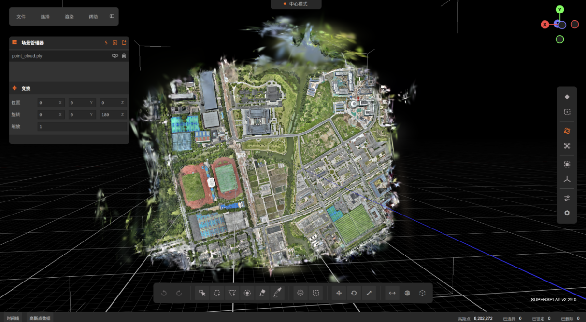

图1-1  3DGS渲染·研究区正射俯视（大尺度全局）

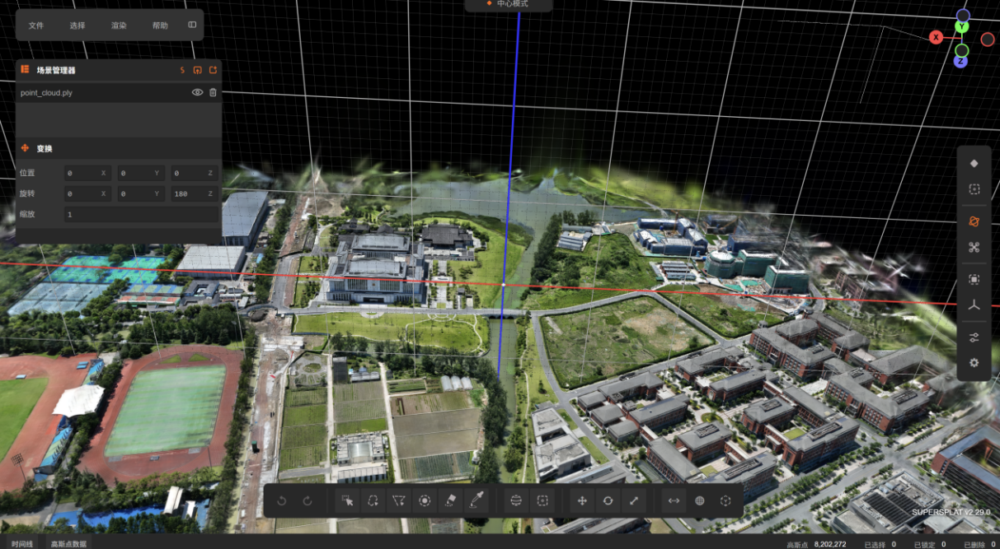

图1-2  3DGS渲染·斜视鸟瞰全区

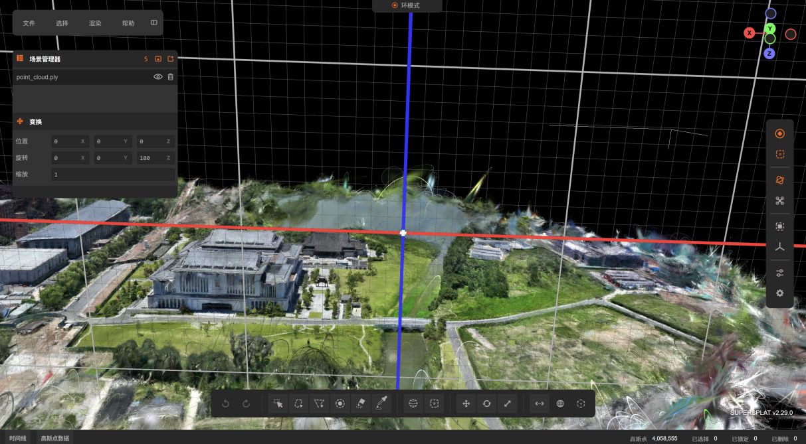

图1-3  3DGS渲染·主图近景低角度斜视（中尺度）

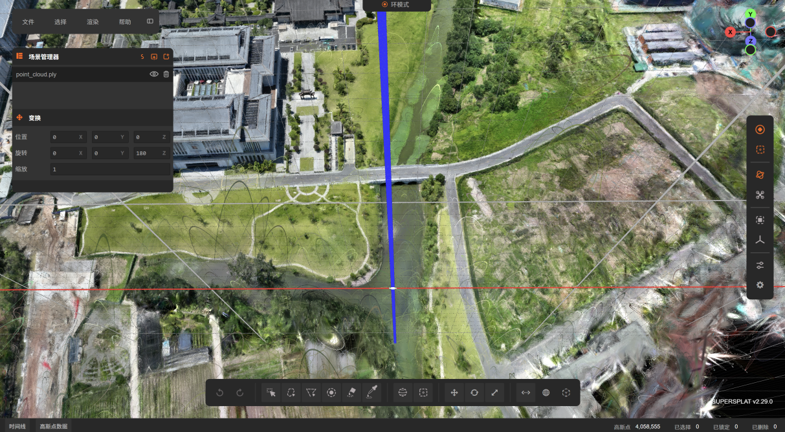

图1-4  3DGS渲染·路与水系近景（小尺度细节）

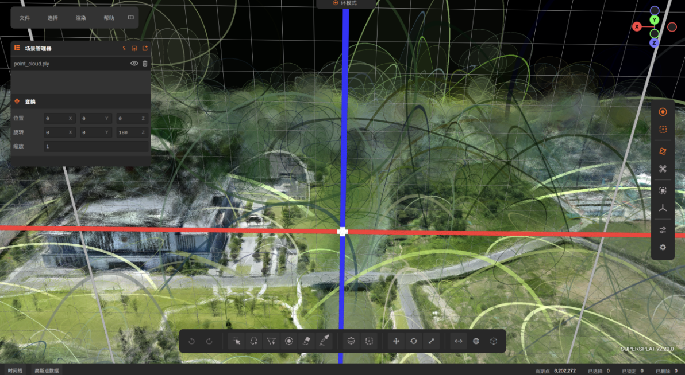

图1-5  3DGS环模式（小尺度细节）

### **（二）二维高斯泼溅（2DGS）提取的三角网格（Mesh）预览**

**（2DGS训练后提取的带纹理三角网格，在MeshLab中预览，展示不同缩放尺度与视角）**

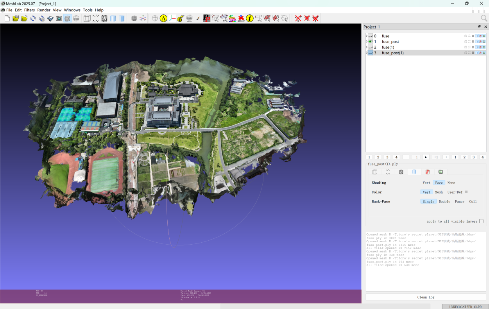

图1-6  2DGS三角网格·研究区整体俯视

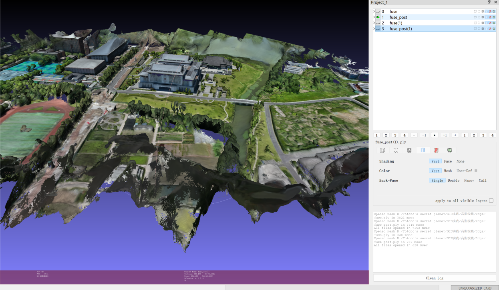

图1-7  2DGS三角网格·低角度斜视

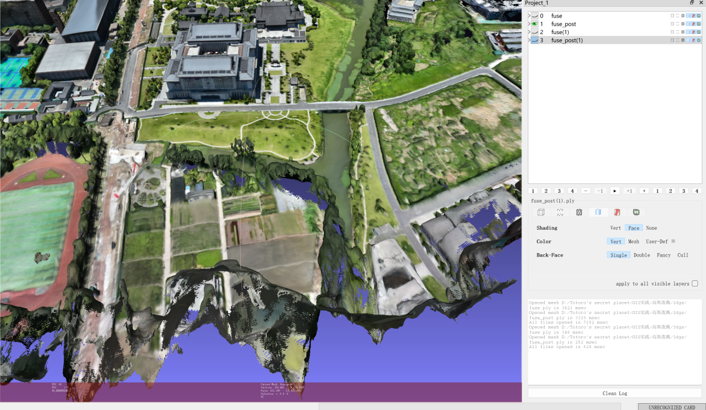

图1-8  2DGS三角网格·高角度斜视

**2DGS提取的三角网格Mesh文件（PLY格式，fuse_post.ply）已随报告一并提交。**

### **（三）DJI Terra 机器直接输出的渲染成果（补充）**

**下列为DJI Terra软件直接输出的高斯泼溅、三角网格与二维正射（DOM）成果，作为对照补充。**

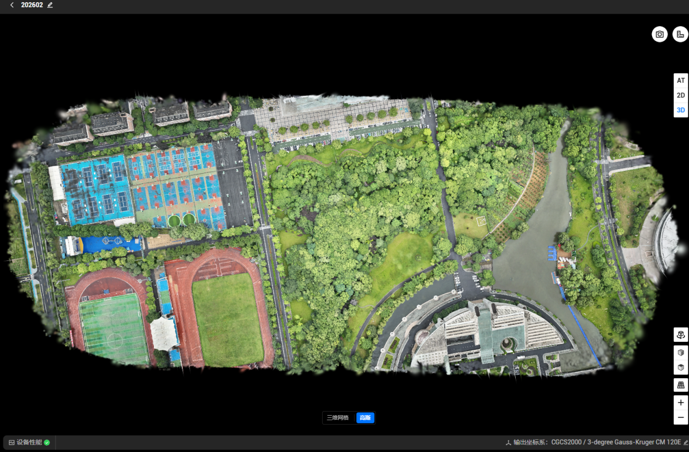

图1-9  DJI Terra 高斯泼溅·研究区正射俯视

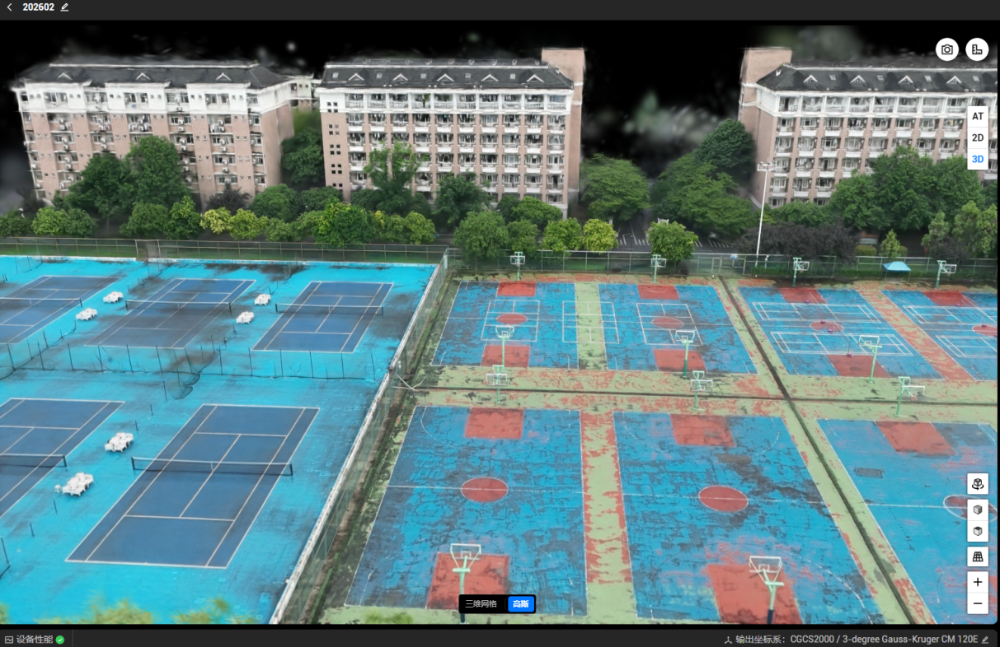

图1-10  DJI Terra 高斯泼溅·室外篮球、网球场近景斜视

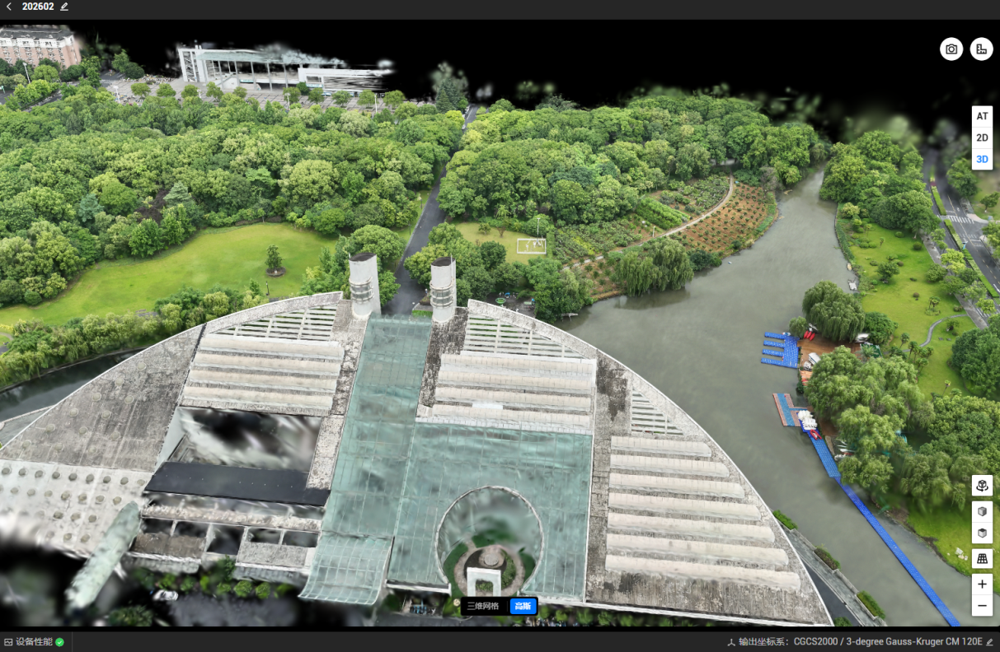

图1-11  DJI Terra 高斯泼溅·月牙楼及水系斜视

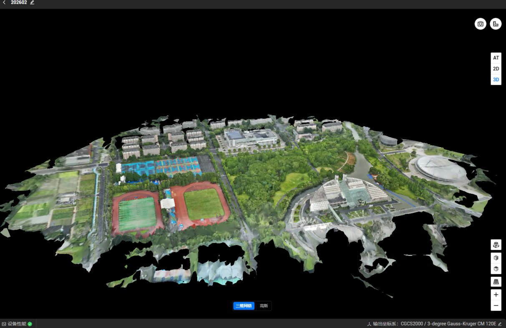

图1-12  DJI Terra 三角网格·研究区整体斜视

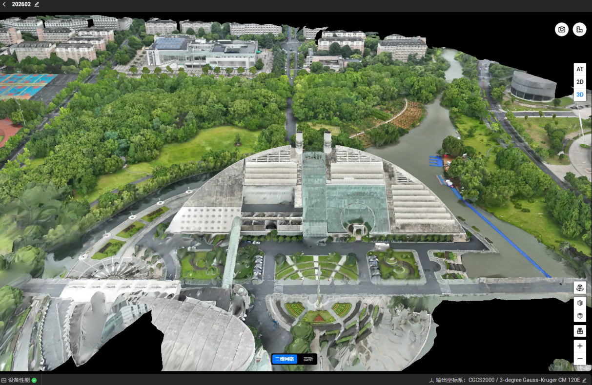

图1-13  DJI Terra 三角网格·月牙楼俯视

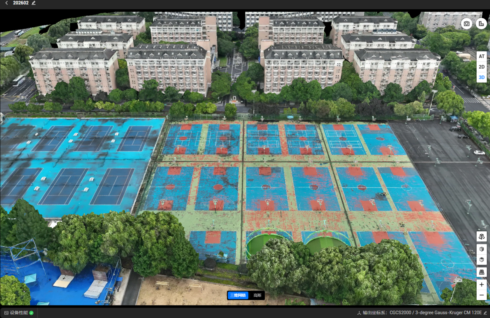

图1-14  DJI Terra 三角网格·室外篮球、网球场斜视

图1-15  研究区二维正射影像（DOM）

### **几何精度与视觉表现**

**二维网格：地物纹理及平面分布丰富，适合制作DOM。**

**三维网格：空间拓扑完整，但建筑边缘等复杂结构易发生纹理拉伸变形。**

**高斯泼溅：空间体感逼真，复杂细节还原细腻，视觉真实感最佳。**

### **数据效率与资源占用**

**二维网格：生成极快、数据量最小，便于快速浏览。**

**三维网格：重建耗时长、数据量巨大，存储及加载硬件要求高。**

**高斯泼溅：渲染效率具优势，但内存占用大、算力挑战高。**

### **适用场景评价**

**二维网格：适合大范围全局俯瞰与二维基础分析。**

**三维网格：适合精确空间量测、DEM/DSM生成及微地形分析。**

**高斯泼溅：具备极佳沉浸感，更适用于三维数字孪生与高保真场景展示。**

**上述成果的Mesh文件（PLY）、点云、DOM及空三质量报告等已随报告一并提交归档，成果坐标系统一为CGCS2000 3°带高斯-克吕格投影（中央经线120°E）。**

## 实习感想

**经验分享：飞行前应规划好航线并设置足够的航向/旁向重叠度（本次为80%/70%），可提升空三匹配特征点数量、减少模型边缘变形与空洞；****点位选取遵循“平地无遮挡、特征边缘清晰”的原则，优先选取跑道白线交界处、篮球场边界、斑马线等地物几何特征显著的点位，并采用RTK测量设备进行高精度坐标量测，以保障后续空三解算的基础精度****；****本组采用了“免像控”技术路径，即跳过像控点平差步骤，直接基于机载POS数据进行空三解算并进入三维重建环节，从而显著提升了内业处理效率。**

**遇到的困难：复杂结构（如建筑边缘）在三维网格中易出现纹理拉伸变形；三维高斯泼溅虽视觉效果最佳，但内存占用大、对算力要求较高，重建耗时较长。**

**实验一完整实验数据可见百度网盘**

**https://pan.baidu.com/s/53xGUPuh1dnY0P686l9aH8Q**
