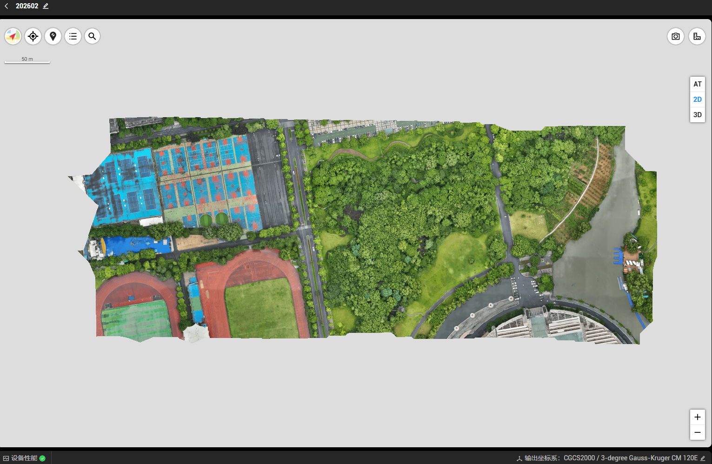

# 实习一：无人机摄影测量

本目录保留无人机摄影测量的结果截图与整理后的成果图，适合作为 GitHub 文件夹页的快速入口。重点内容是 3DGS 渲染和 2DGS 网格预览，不再重复完整报告正文。

## 主要文件

- `结果图/`：精选成果图，包含高斯泼溅、三维网格和 2D 视图的不同尺度结果
- `实习一.md`：完整实验报告
- `实习一_media/`：报告正文配图资源

## 说明

这里展示的是便于浏览和对外说明的目录摘要，详细实验过程、参数和分析仍保留在报告中。
