# 实习二：无人机高光谱影像

## 实习目的

1. 了解无人机高光谱相机的具体操作过程及注意事项

1. 熟练使用无人机高光谱相机进行地面数据采集

1. 掌握高光谱影像数据处理的具体流程

## 实习内容

1. 实习成员以小组为单位，使用无人机高光谱相机在各自实习区域内进行外业测量。

1. 基于无人机高光谱相机采集的影像数据，进行数据处理，包括数据导出、几何校正、影像拼接和反射率计算等步骤，获取高光谱反射率影像。

1. 基于高光谱反射率影像，分析影像地物特征。

## 实习步骤

见《实习手册》

## 实习结果

      1. 展示高光谱影像图结果并制图。

      1. 展示不同类型地物的光谱曲线并分析。

请将实习结果的截图附在这里，并加上必要的文字说明

请保存好实习结果的数据文件

### 高光谱影像图

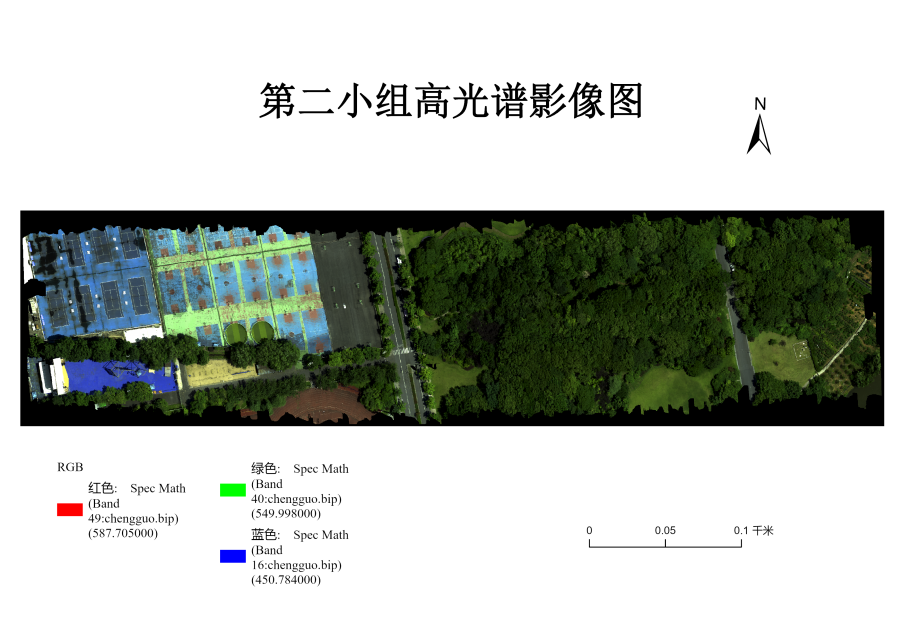

包含了左侧的运动场、塑胶场地，中部的道路建筑，以及右侧的成片林地、草坪等多种地物类型。是经过几何校正、影像拼接与辐射定标、反射率计算后得到的最终成果

说明：本节各光谱曲线横轴为波长（约 400—1000 nm，含可见光与近红外），纵轴为反射率；黑线为 ROI 内像元的平均光谱，绿线为均值 ±1 个标准差，红线为最小/最大值，分析以黑色均值线为准。900 nm 之后各曲线普遍出现的剧烈抖动与红/绿线发散，是成像光谱仪在探测器长波边缘信噪比下降、加之当天风大导致条带与几何配准残差所致，属仪器与外业噪声，分析时以 450—900 nm 的均值趋势为主。

### 柏油路

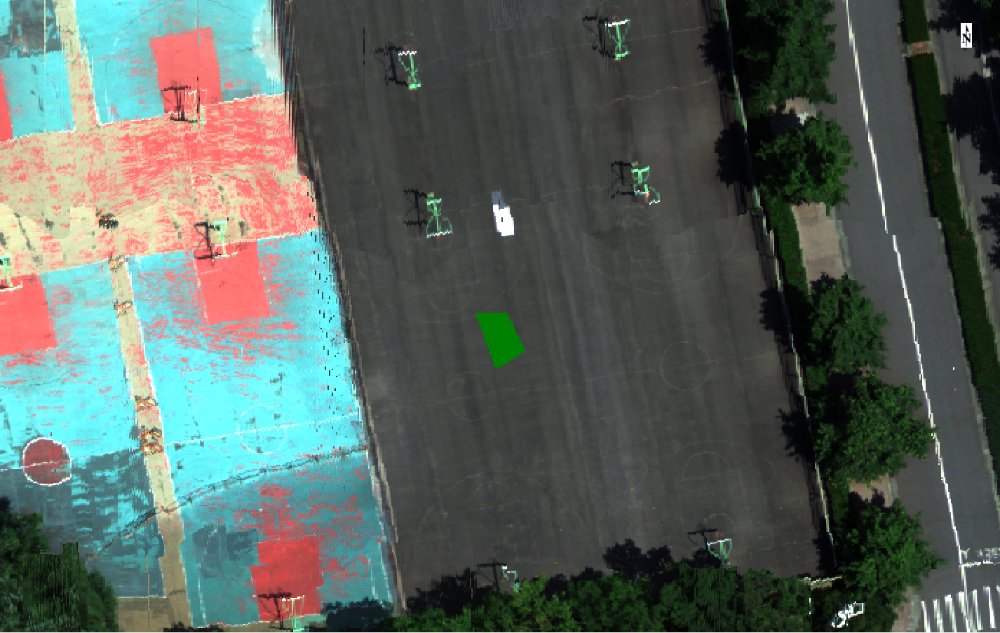

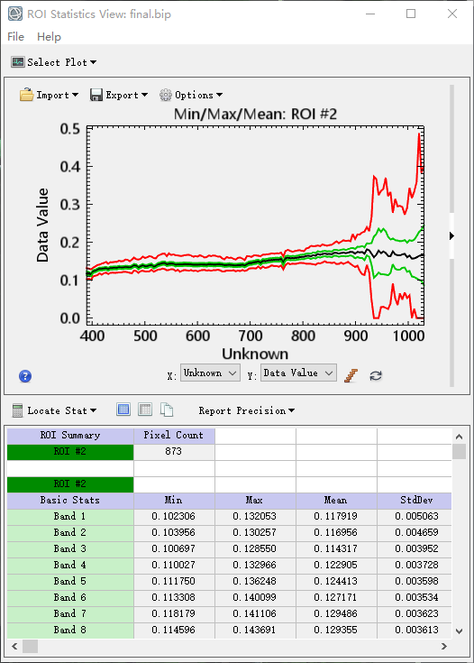

柏油路：反射率整体很低（均值约 0.11→0.13），全波段近乎平直、仅随波长极缓慢单调上升，无明显吸收或反射峰。这与沥青路面富含碳质、反照率低、光谱“灰而平”的特性一致；缺乏叶绿素红边和水体吸收特征，是典型的人工不透水面暗地物。标准差很小，说明路面材质均匀。

### 人工草皮

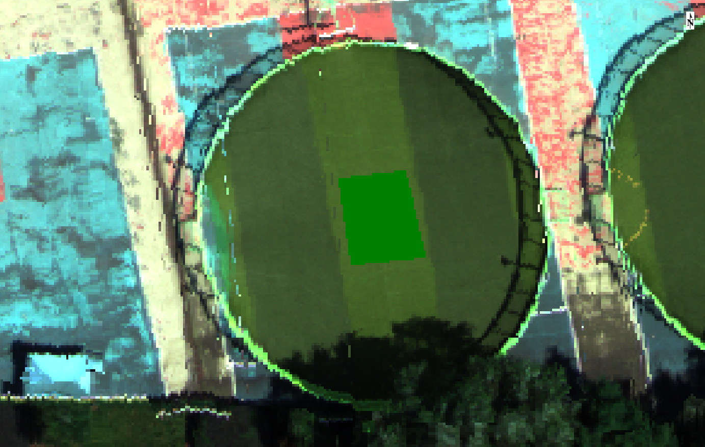

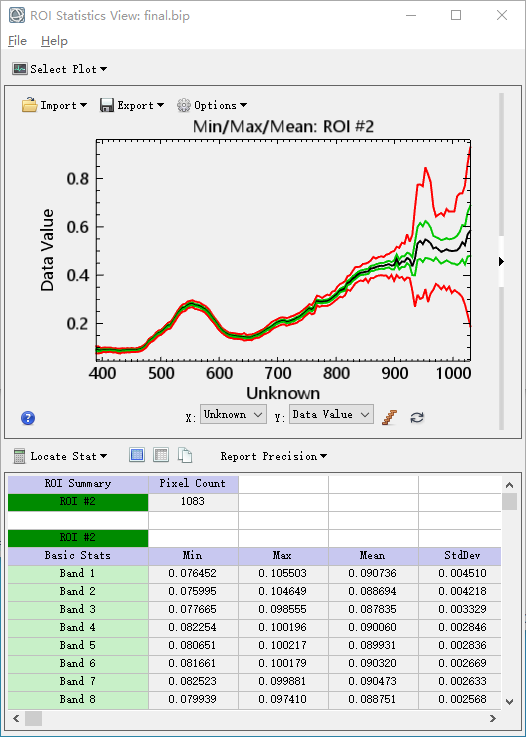

人工草皮：在 550 nm 附近出现绿峰、670 nm 附近有较弱的红光吸收谷，700 nm 后反射率上升至近红外约 0.5—0.6。曲线在形态上刻意模仿绿色植被，但红边过渡平缓、近红外没有真植被那样陡峭的跃升与高位平台，说明其“绿”来自染料而非叶绿素，也缺乏叶片海绵组织的强近红外散射。这一差异正是遥感区分人工草皮与真实草地的关键。

### 沙地

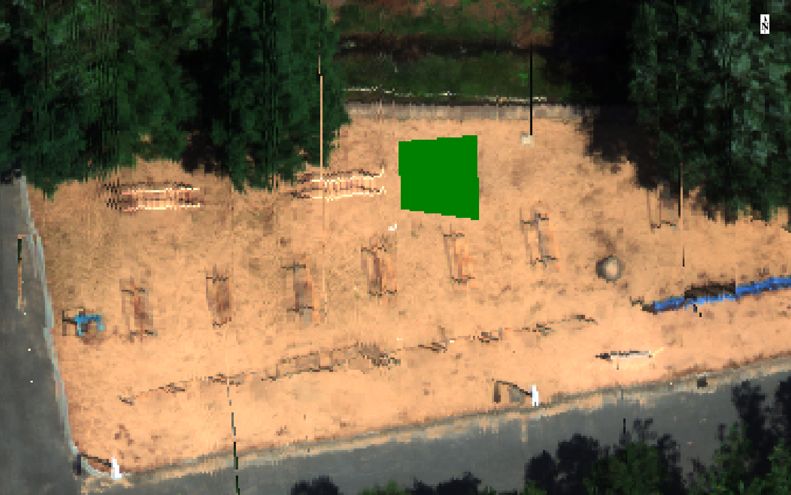

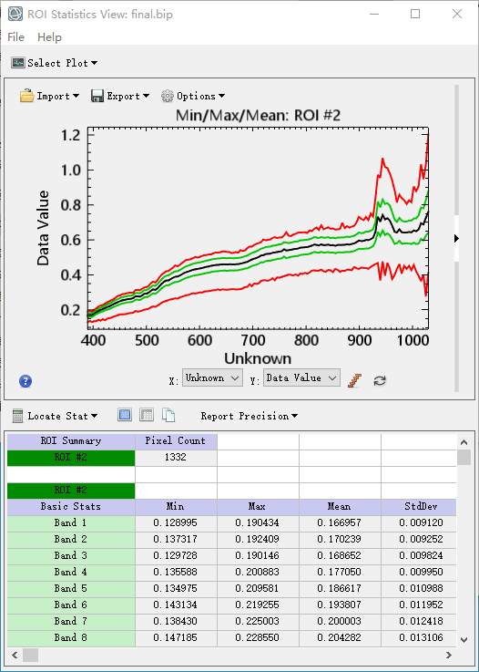

沙地：反射率高且随波长平滑单调上升（均值约 0.17→0.7），无叶绿素吸收谷。这是明亮矿物/干燥颗粒地表的典型特征：颗粒散射强、反照率高，可见光到近红外反射率持续增大，是场景中最亮的自然地物之一。

### 水域

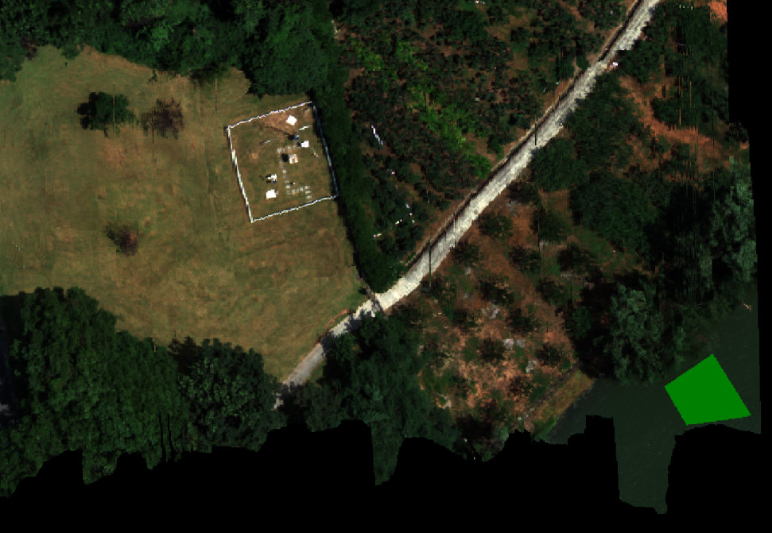

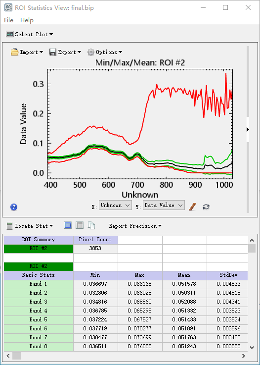

水域：可见光段反射率低、在 550—580 nm 有微弱绿/黄峰（指示水中悬浮泥沙或轻微浑浊），700 nm 之后均值迅速下降并趋近于 0。近红外强吸收使反射率接近零，是水体最具诊断性的光谱指纹。红线在近红外偏高且发散，多为岸边混合像元或水面镜面反射所致。

### 塑胶跑道

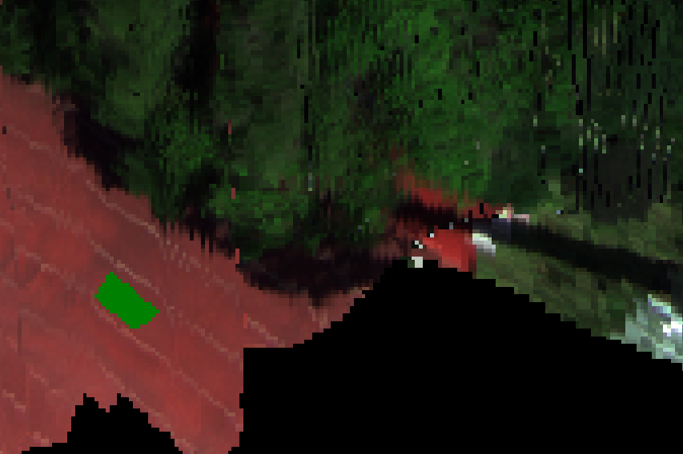

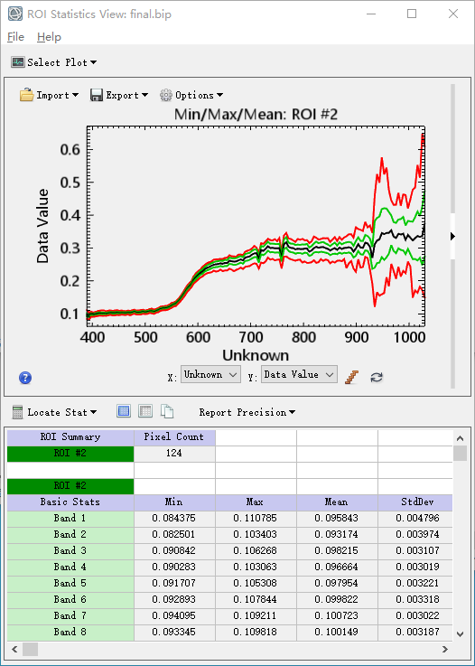

塑胶跑道：蓝绿波段反射率低（约 0.09），在 550—650 nm 出现陡升，随后在红光—近红外维持约 0.30—0.35 的平台。这对应红色系塑胶材料：强烈反射红光、平台平直。与植被的区别在于没有 670 nm 叶绿素吸收谷，抬升位置在红光区而非 700 nm 红边，且近红外为平台而非继续攀升。

### 植被

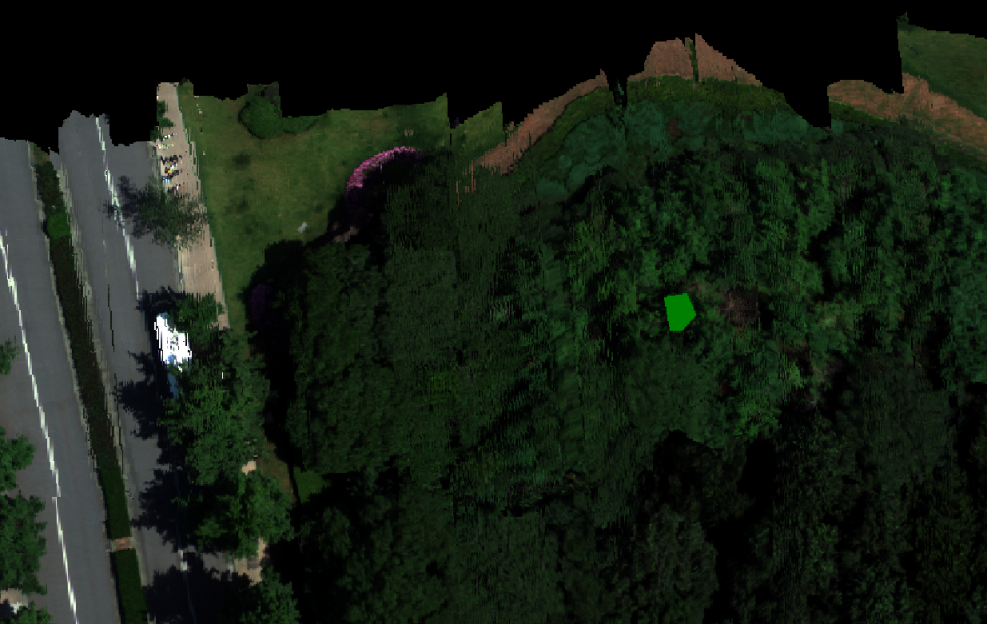

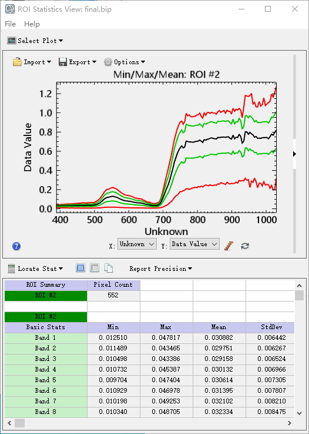

植被：标准健康绿色植被曲线。可见光反射率极低（约 0.03），550 nm 绿峰、670 nm 叶绿素红光吸收谷，700—750 nm 出现极陡的“红边”，近红外形成约 0.8 的高反射平台。可见光低反射源于叶绿素强吸收，近红外高反射源于叶片细胞组织的多次散射，是典型乔木/浓密植被响应。

### 橡胶地面（蓝色）

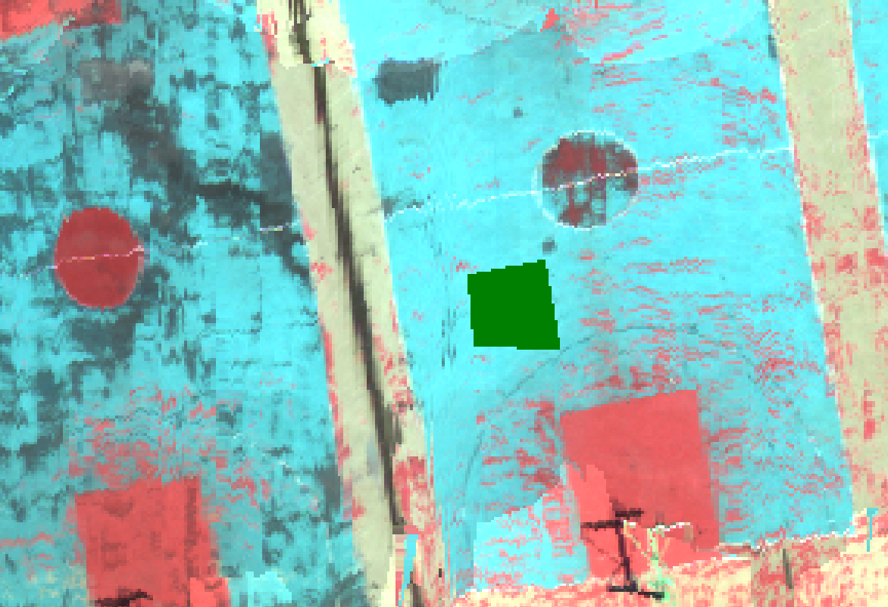

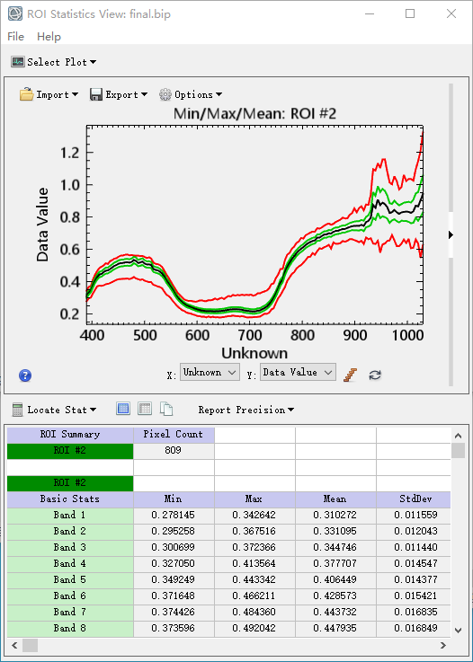

橡胶地面（蓝色）：蓝绿波段（约 480—520 nm）出现约 0.44 的高反射峰，红光区（650—700 nm）降至约 0.28 的低谷，随后近红外强烈上升至约 0.8。高蓝光反射与红光吸收和其“蓝色”外观一致；近红外的抬升是这类橡胶合成材料的共性。整体反照率较高，属明亮蓝色人工面。

### 橡胶地面（深红）

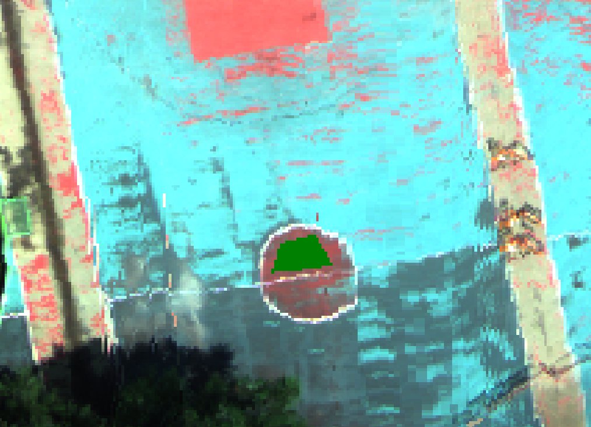

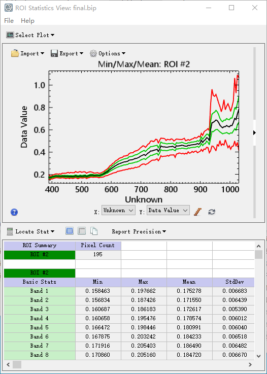

橡胶地面（深红）：与蓝色橡胶恰相反，蓝绿波段（400—560 nm）反射率低而平（约 0.17，吸收蓝绿光），约 560—620 nm 出现台阶式抬升，之后在红光—近红外单调升高至约 0.6。强红光反射、蓝绿光吸收对应“深红”色调；缺乏叶绿素吸收谷可与植被区分。

### 橡胶地面（深蓝）

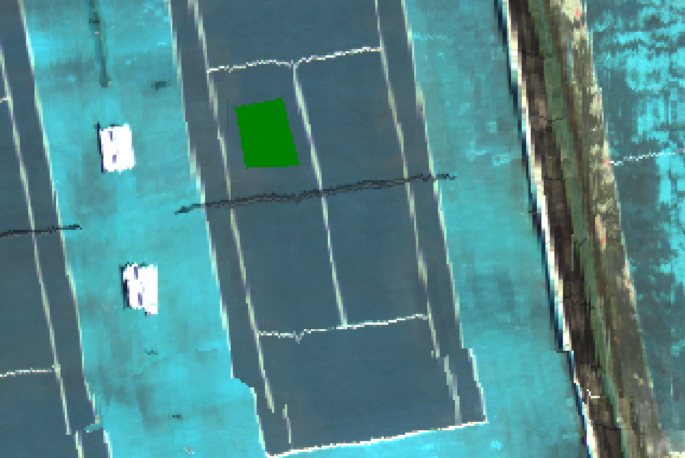

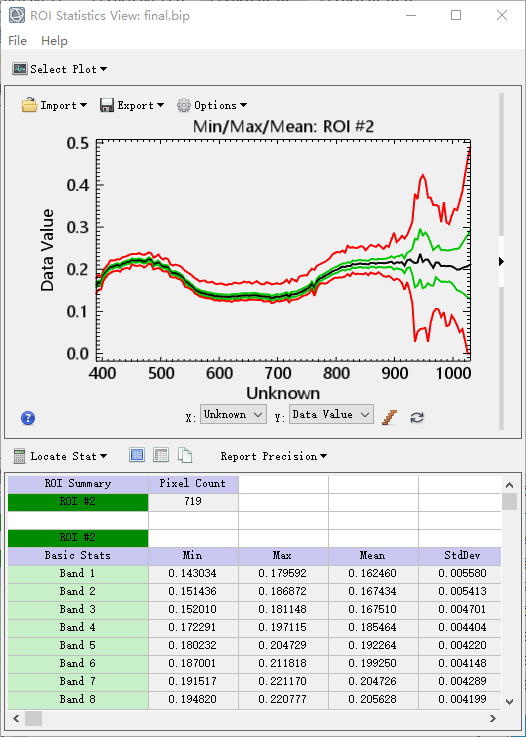

橡胶地面（深蓝）：全波段反射率低且平坦（均值约 0.16—0.20），仅 450—500 nm 有微弱蓝光隆起，近红外无明显抬升。与“蓝色橡胶”对比可见：颜色越深、饱和度越低，整体反照率越低、光谱越“平”。属低反照率、弱特征的暗蓝色人工面。

### 铁皮屋顶

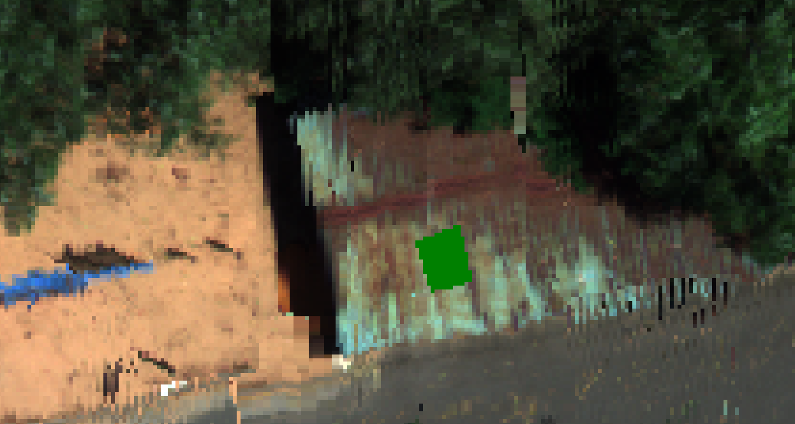

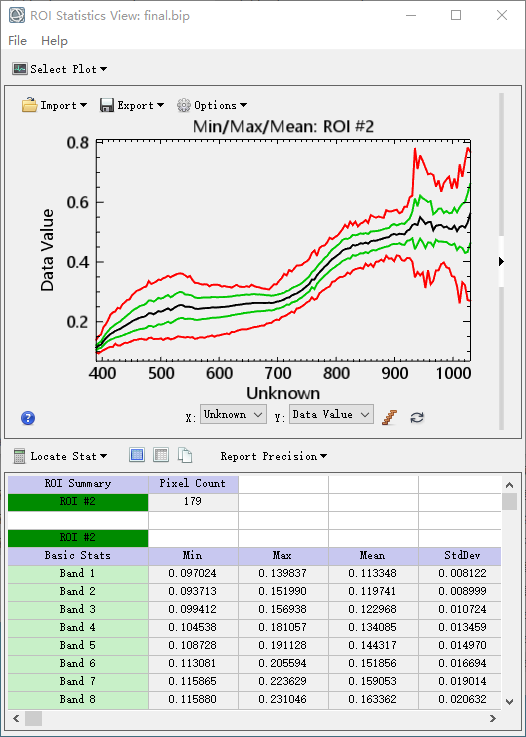

铁皮屋顶：反射率由约 0.11 逐渐升高，500—550 nm 有一处较宽的隆起，其后向近红外持续上升至约 0.5。中等反照率、随波长上升，隆起来自屋面涂层颜色，近红外抬升与金属/涂层反射有关。标准差偏大，反映屋顶存在锈蚀、涂层不均或镜面反射造成的像元差异。

### 积水的橡胶地面

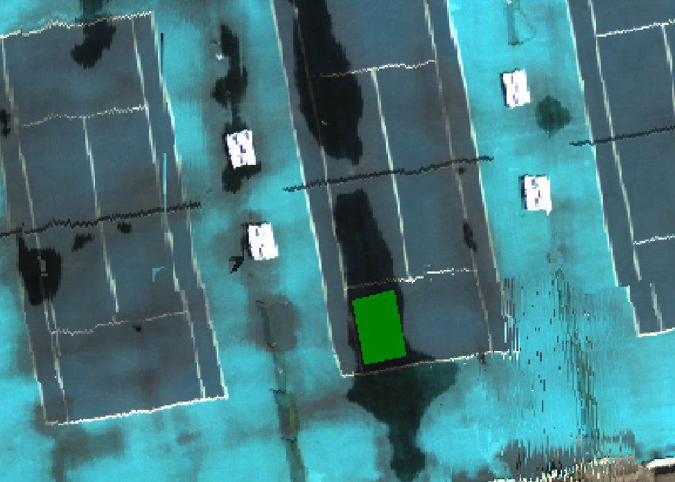

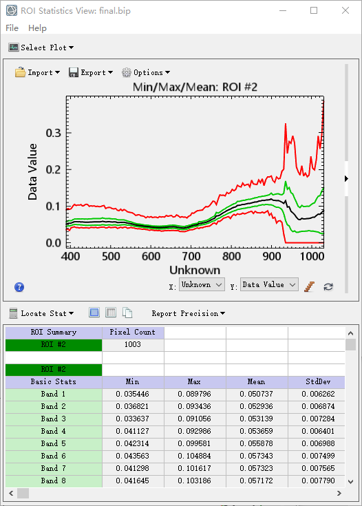

积水的橡胶地面：可见光反射率很低且平（约 0.05），700—900 nm 略有抬升至约 0.1，930 nm 后明显回落。相比干燥橡胶（反射率高、近红外强升），此处反射率被整体压低、且近红外出现吸收下降——这是覆盖水膜的典型效果：表层积水强烈吸收近红外并压制总反射率，形成“橡胶基底 + 水体吸收”的混合光谱。

### 草地

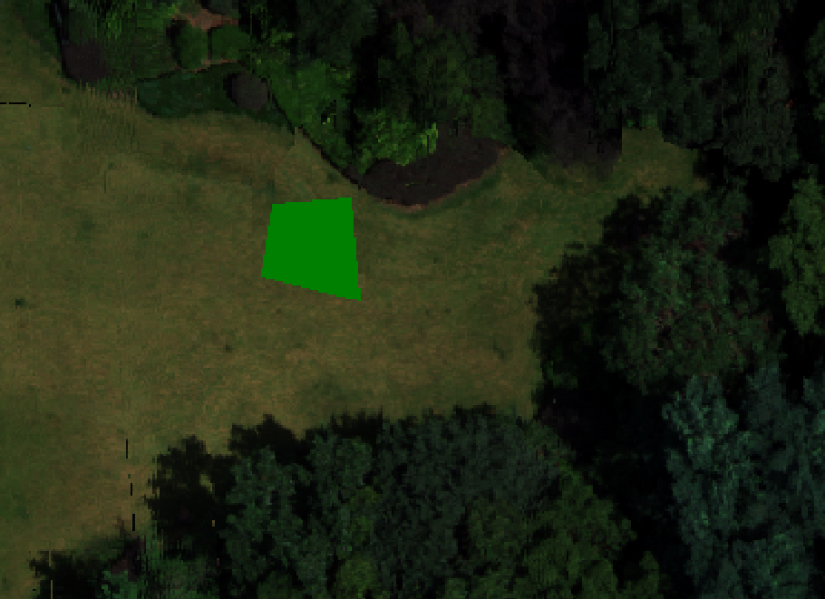

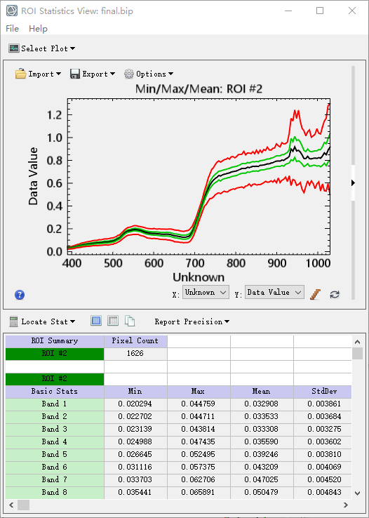

草地：同属健康植被曲线，550 nm 绿峰、670 nm 红光吸收谷、700 nm 陡峭红边、近红外约 0.8 高平台。与乔木植被形态一致，草本植被近红外平台通常略低或相当。叶绿素与叶片结构共同决定了“低可见光—高近红外”的植被特征。

### 裸地

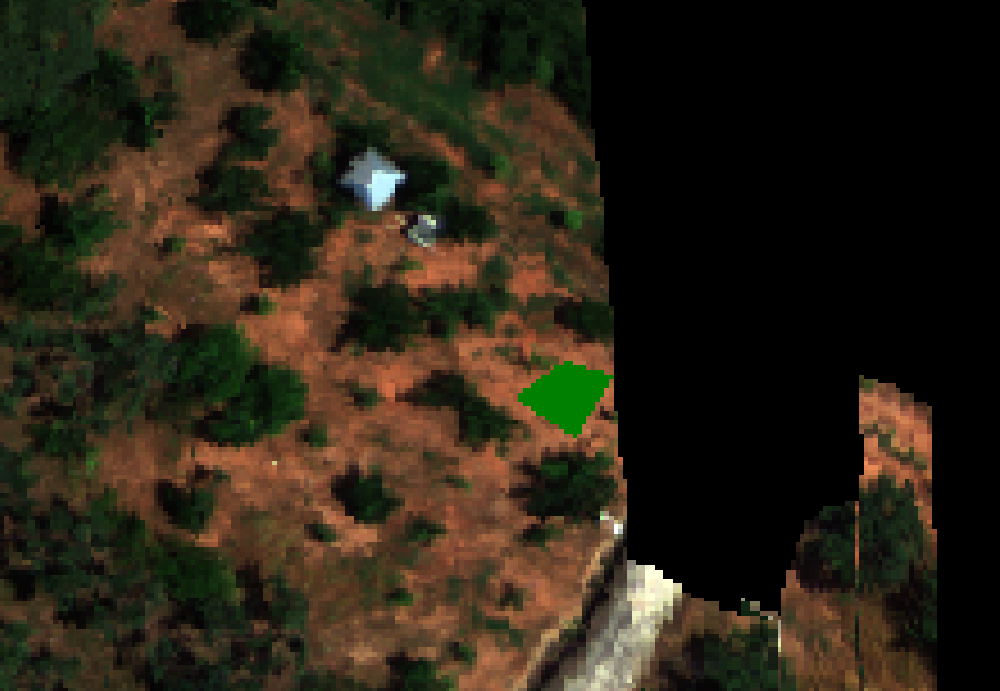

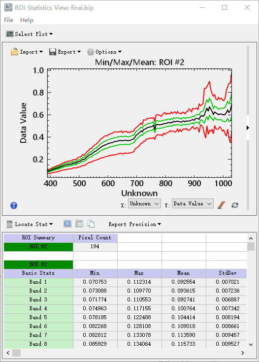

裸地：反射率随波长平滑单调上升（均值约 0.09→0.6），无叶绿素吸收谷。典型干燥裸土：反照率介于柏油路与沙地之间，可见光到近红外持续增大；曲线略显平缓上凸，可能受土壤含水量与有机质影响。

总体而言，各类地物清晰可分。

植被具备最典型的植被 “三段式” 标志性特征。

水体全波段反射率最低，与其他地物区分度最高。

人造地物（铁皮屋顶）单调缓升型，无显著特征峰谷。

裸地缓坡上升型，与屋顶趋势相似但数值更低。

人工草皮VS天然草地：两者都具备典型的植被光谱 “三段式” 特征：可见光波段 550nm 附近有清晰的绿色反射峰，700-760nm 出现陡峭的红边上升；近红外波段维持高反射平台。近红外反射率差异最显著：天然草地的近红外平均反射率明显高于人工草皮，整体高出约 30%~40%。天然草地的光谱曲线波动更自然，异质性更强；人工草皮的曲线形态更规整，可见光绿峰更突出、更尖锐。

干橡胶路面 vs 积水橡胶路面：可见光波段（400-700nm）两者的反射率水平、曲线形态非常接近，都符合橡胶材质的平缓上升趋势，在普通 RGB 影像中很难直观区分路面干湿状态。进入 700nm 近红外波段后，两条曲线出现明显分化：干橡胶路面反射率持续缓慢上升，保持人造建材的典型缓升形态；积水橡胶路面反射率上升趋势明显放缓，900nm 后出现下降拐点，整体近红外反射率低于干路面，呈现出水体的吸收特征。

同物异谱现象（以不同颜色橡胶运动场地为例）：整体反射率水平：亮蓝橡胶 > 深红橡胶 > 深蓝橡胶，差值最高可达 0.6 以上。可见光特征：深蓝橡胶蓝端反射强、红光段强烈吸收；深红橡胶红光段反射明显抬升；亮蓝橡胶全波段反射均处于高位。近红外趋势：颜色越浅、表面磨损越明显，近红外波段的上升斜率越大。异主要来自两方面：一是表面涂层的颜料成分不同，对可见光不同波段的选择性吸收 / 反射能力不同；二是场地使用时长、老化磨损程度有区别，改变了表面粗糙度与反射特性。

## 实习感想

经验分享：飞无人机时注意防晒，并要时刻关注无人机与平板之间的信号连接，避免有障碍物遮挡干扰。

遇到的困难：一开始影像中有较多空白条带，可能是由于当天风较大，无人机在飞行时有偏移。我们通过重采样使得影像的显示效果有所提升。

**实验二完整实验数据可见百度网盘**

**https://pan.baidu.com/s/5nftRSaxFx-2ixoRI2PZS9g**
