# 实习三：便携式地物波谱仪（ASD）

## 实习目的

1. 掌握地物反射波谱测量的基本原理

1. 了解典型地物类型的光谱特征

1. 了解ASD具体操作过程及注意事项

1. 熟练使用ASD进行实地测量

## 实习内容

以小组为单位，使用便携式地物光谱仪（ASD）针对各自实习区域内的常见地物进行光谱曲线测量。测量地物包括（但不限于）以下类别：①植被（例如草地、灌木、树木、农作物等）；②土壤（裸地、沙地、农田土壤等）；③水体（湖泊、河流等）；④人造地物（建筑物、道路、人造草坪等）。要求完成至少20条不同地物的光谱曲线，并分析其特征。

## 实习步骤

见《实习手册》

## 实习结果

1. 对实地测量所得的光谱曲线进行记录，参考记录表格格式如下：

| **一级地物** | **二级地物** | 序号 | 地物名称 | 采集地点 **(****文字描述+地图标注)** | 实物图片 | 反射光谱曲线 |
| --- | --- | --- | --- | --- | --- | --- |
| 植被 | 乔木（树干） | 1 | 树干 | 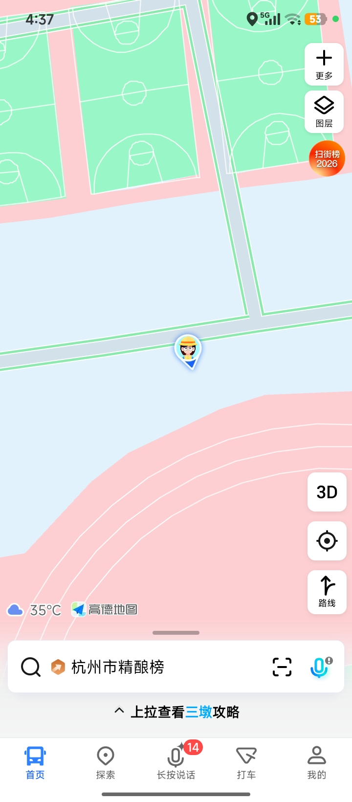 东操和东篮球场之间道路旁边 | 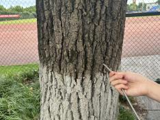 | 意外被覆盖了 |
|  | 草本（麦冬） | 2 | 麦冬 |  东操和东篮球场之间道路旁边 | 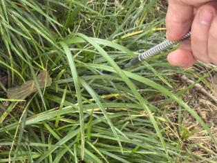 | 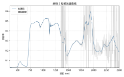 |
|  | 乔木（叶片） | 5 | 叶子 | 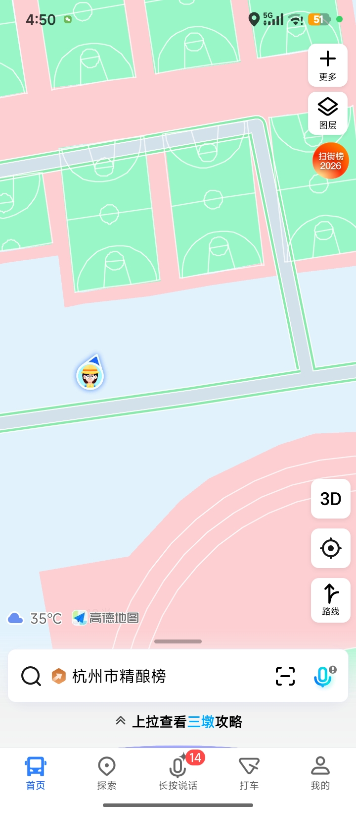 东操和东篮球场之间的沙地上 | 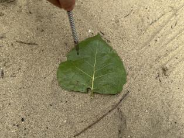 | 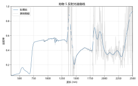 |
|  | 草地 | 11 | 草地 | 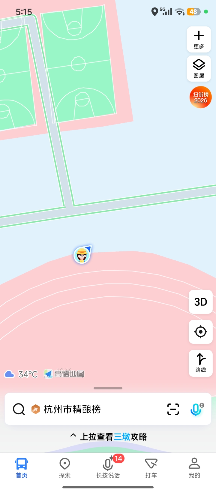 东操旁边 | 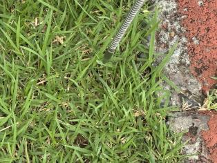 | 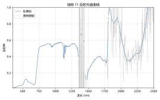 |
|  | 灌木 | 21 | 低矮灌木 | 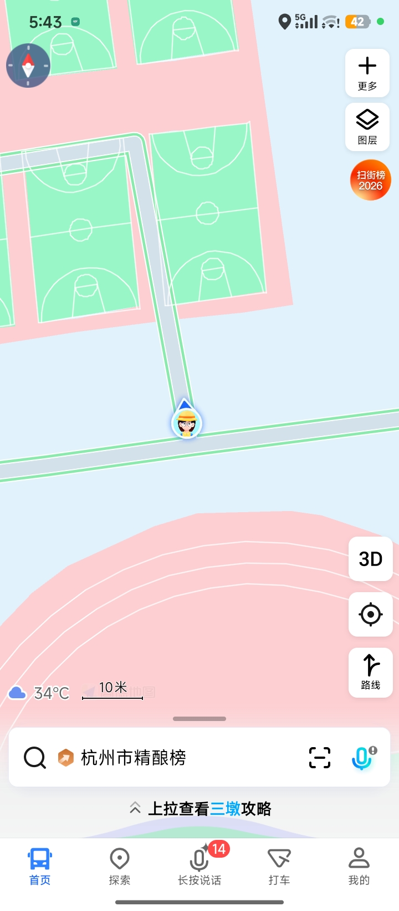 东篮球场南2门旁边 | 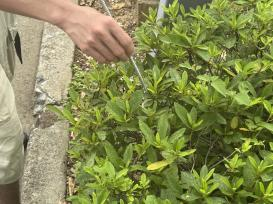 | 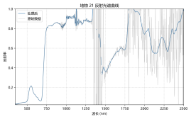 |
|  | 花卉 | 22 | 玫红色花朵 |  东篮球场南2门旁边 | 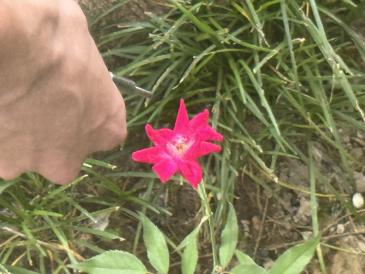 | 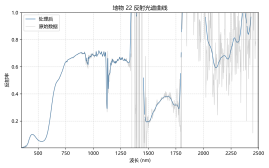 |
|  | 枯萎植被（枯叶） | 20 | 枯叶 | 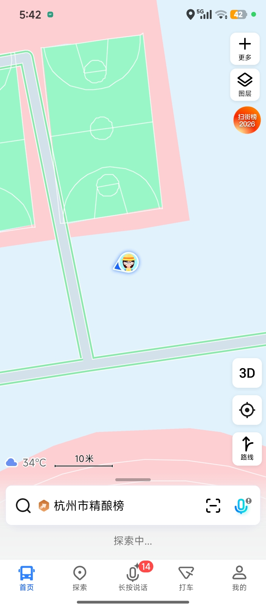 东篮球场南2门旁边 | 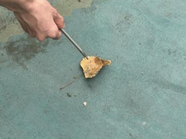 | 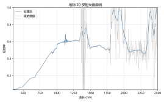 |
| 土壤 | 沙地 | 3 | 沙地 |  东操和东篮球场之间的沙地 | 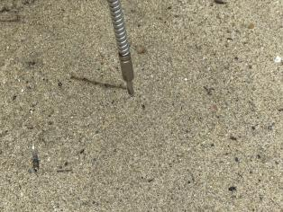 | 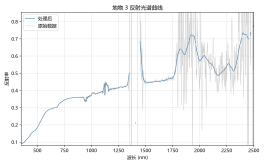 |
|  | 裸地 | 12 | 裸地 |  东操旁边 | 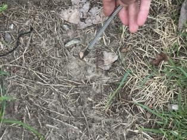 | 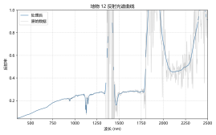 |
|  | 岩石（石台） | 13 | 石台 | 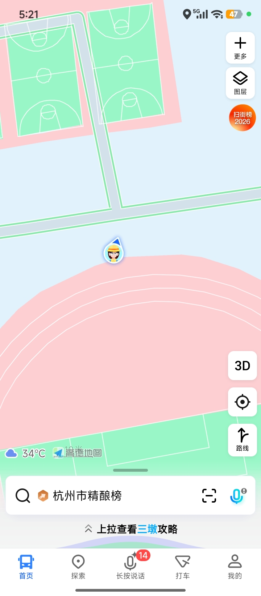 东操北2门下 | 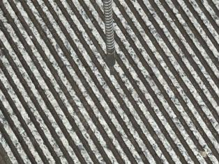 | 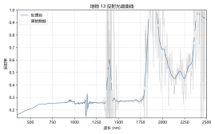 |
|  | 岩石（石头） | 23 | 石头 | 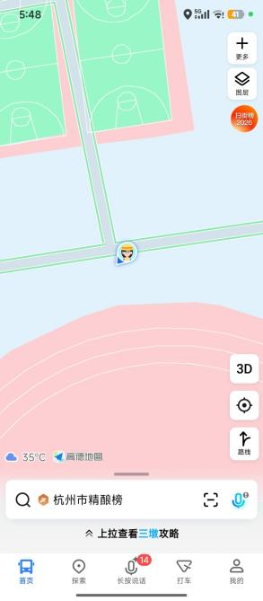 东操北2门旁边 | 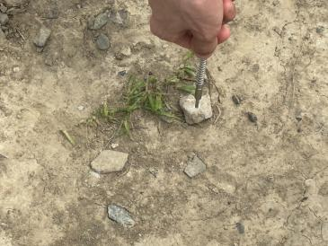 | 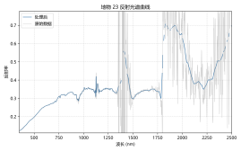 |
| 水体 | 静水（水样） | 15 | 水 |  东操北2门 | 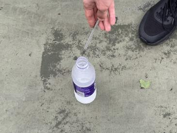 | 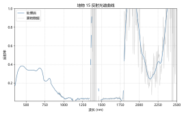 |
| 人造地物 | 塑料制品 | 4 | 塑料板 |  东操和东篮球场之间的沙地上 | 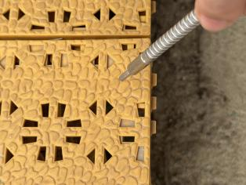 | 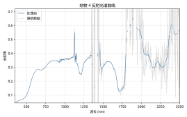 |
|  | 金属井盖 | 6 | 井盖 |  东操和东篮球场之间的沙地中 | 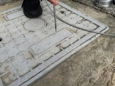 | 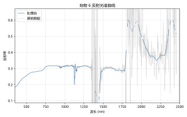 |
|  | 道路（沥青） | 7 | 柏油路面 |  东操和东篮球场之间 | 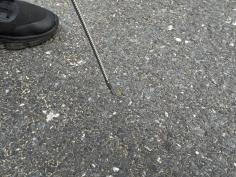 | 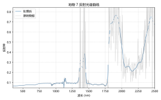 |
|  | 建筑物 | 8 | 建筑物墙面 |  东操和东篮球场之间 | 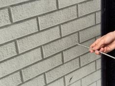 | 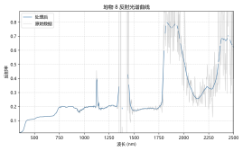 |
|  | 金属构件 | 9 | 铁架 | 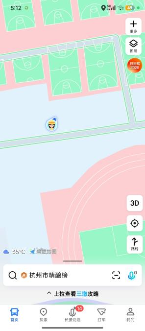 东操和东篮球场之间的沙地 | 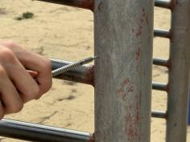 | 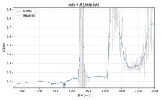 |
|  | 运动场地（塑胶） | 10 | 塑胶跑道 |  东操 | 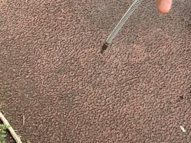 | 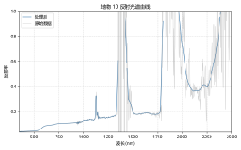 |
|  | 运动场地（橡胶） | 14 | 橡胶路障 |  东操北2门的橡胶面 | 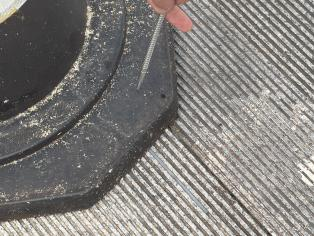 | 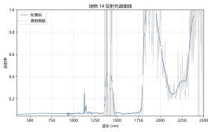 |
|  | 运动场地（橡胶） | 16 | 橡胶地面 | 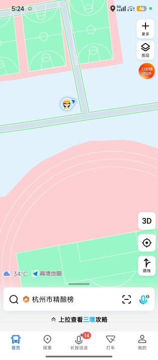 东篮球场南2门旁边 | 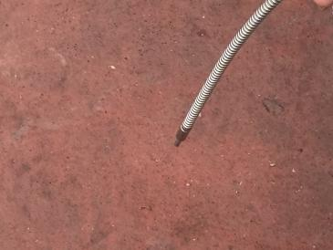 | 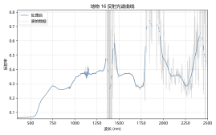 |
|  | 棚膜（遮雨棚） | 17 | 遮雨棚 | 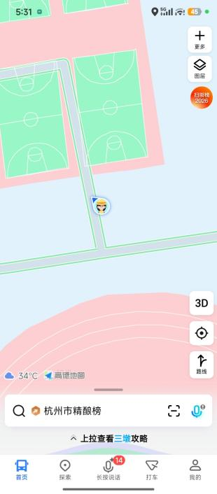 东篮球场南2门旁边 | 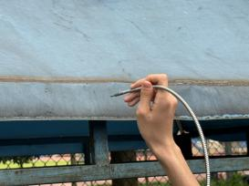 |  |
|  | 人造草坪 | 18 | 人造草皮 |  东篮球场 |  |  |
|  | 涂漆金属设施 | 19 | 光滑绿色油漆篮球架 |  东篮球场 |  |  |

**植被类（序号2麦冬、5叶片、11草地、20枯叶、21灌木、22花卉；序号1树干因数据被覆盖无曲线）：活体绿色植被呈典型“三段式”特征——可见光低反射、550 nm附近绿峰、680 nm红光吸收谷，约700 nm后出现陡峭“红边”并在近红外形成高反射平台；草地、灌木近红外平台更高，反映冠层多重散射更强。花卉因探头视场中花瓣与绿叶混合，仍以绿色叶片贡献主导而保留植被形态；枯叶因叶绿素退化，红光吸收与红边明显减弱，曲线接近干燥有机质/裸土的缓升型。1400/1900 nm处的低谷主要为叶片含水吸收。**

**土壤/岩石类（序号3沙地、12裸地、13石台、23石头）：均无明显红边，反射率随波长整体缓慢上升，反映矿物颗粒与干燥表面散射占主导。沙地反照率最高，裸地受枯草/土壤混合影响居中，石台、石头受材质、粗糙度与阴影影响，曲线波动相对更大。**

**水体类（序号15水）：可见光蓝绿波段有少量表面反射与散射形成的弱峰，进入近红外后反射率迅速下降并维持低值；NIR—SWIR强吸收（低反射）是区分水体与陆地地物最稳定的依据。本次水样受容器、水面角度与周边背景影响，可见光段可能被局部抬高，但不改变主要判读结论。**

**人造地物类（序号4塑料板、6井盖、7柏油路面、8建筑墙面、9铁架、10塑胶跑道、14橡胶路障、16橡胶地面、17遮雨棚、18人造草皮、19绿色油漆篮球架）：受材质、颜料与表面粗糙度主导，光谱形态最为离散。柏油路面、黑色橡胶整体低反射，符合深色材料强吸收特征；塑胶跑道、橡胶地面随波长上升更明显；塑料板、井盖、墙面、铁架虽同为人工硬质表面却无统一形态，金属（铁架）受锈蚀、涂层与镜面反射影响大。值得注意的是，人造草皮与绿色油漆篮球架虽在绿光—红边段模拟出类似植被的上升，但近红外平台与含水吸收谷明显弱于真实叶片，说明“颜色相似”不等于“光谱机制相同”，这是遥感区分真/假植被的关键。**

**总结：判读优先依赖400—1300 nm稳定波段——以红边识别植被、以近红外低值识别水体、以整体单调上升识别裸土/岩石；1400/1900/2400 nm附近的波动仅作数据质量提示，不作为地物特征解释。**

1. 利用ViewSpec Pro软件导出曲线数据的txt格式文件，生成地物平均光谱曲线，并分析各类别光谱曲线的特点。

**说明：利用ViewSpec Pro将.asd原始数据导出为文本，统一波长范围（350—2500 nm）后用Python绘制单地物曲线、全地物汇总图与中位数（含25%—75%分位带）曲线。需注意：1350—1450 nm、1800—2000 nm及2400 nm附近的剧烈尖峰主要为大气水汽吸收带噪声，属低可信波段，判读以400—1300 nm稳定波段为主。**

图3-1  地物中位数反射光谱曲线（含25%—75%分位带）

全体曲线重叠度高，均值容易受塑料、金属、跑道等异常峰影响。中位数更适合表达总体中心趋势，能降低个别极端值对曲线形态的干扰。25%-75% 分位距表示同一波段样本差异：分位带越宽，类间差异或噪声越强。400–1300 nm 分位带更适合比较地物差异；吸收带附近变宽主要反映不稳定

图3-2  全部地物反射光谱曲线汇总（黑色虚线为中位数）

**全部曲线差异明显，说明样本覆盖了植被、水体、裸露无机地物和多种人工材料。植被类在 700 nm 后快速分离，是全图中最清晰的类别特征；水样在 NIR-SWIR 长期保持低值。土壤/岩石多呈缓慢上升，人造地物分布更离散，反映颜色、涂层、粗糙度和材质差异。黑色虚线中位数能概括总体趋势，但具体类别解释仍应回到单地物照片和曲线。SWIR 尖峰密集区域不参与核心判读，只用于提示数据质量和后续去噪需求。**

**各地物原始.asd数据、导出文本及绘制的光谱曲线图件已随报告提交归档。**

## 实习感想

**经验分享：测量时探头要垂直对准目标并保持稳定的距离与角度，随光照变化定期重新优化白板校正；每种地物多采集几条曲线，便于后期剔除异常值。**

**遇到的困难：0、1号数据在导出时被误覆盖，导致树干（序号1）无对应光谱结果；当天测量时间为下午16:30—17:00，太阳高度角低、光照偏弱，暗色地物信噪比下降；1400/1900/2400 nm附近水汽吸收带出现尖峰噪声。后续应选择光照充足时段测量、及时备份原始数据，并将水汽吸收带标记为低可信波段处理。**

**实验三完整实验数据可见百度网盘**

**https://pan.baidu.com/s/5MS66hu1srou99SaxLsMWAQ**
