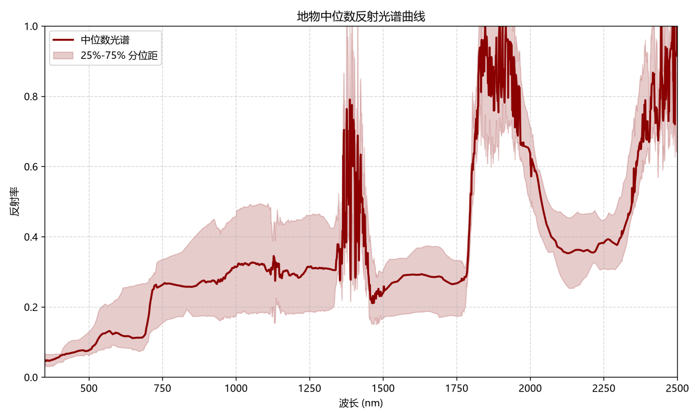

# 实习三：便携式地物波谱仪（ASD）

本目录保存地物光谱采集后的曲线图和汇总结果，适合快速查看植被、水体、土壤和人工地物的光谱差异。这里不再复写完整实验过程，只保留目录入口和代表性成果。

## 主要文件

- `实习三_media/`：光谱曲线、样本照片和汇总图
- `实习三.md`：完整实验报告

## 说明

原始 `.asd` 数据和导出文本按报告说明另行归档，本目录主要用于展示最终图件和常见地物的结果概览。
