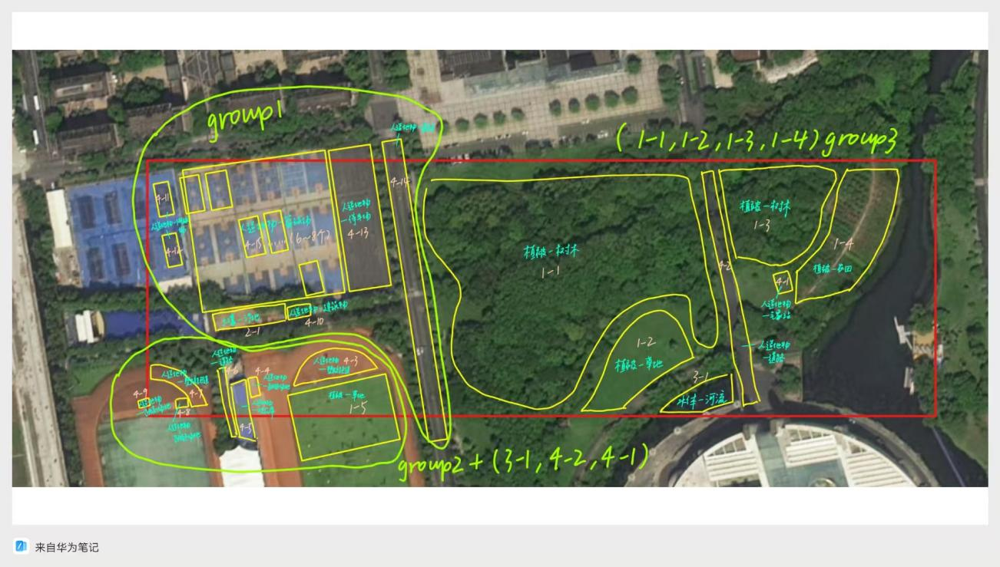
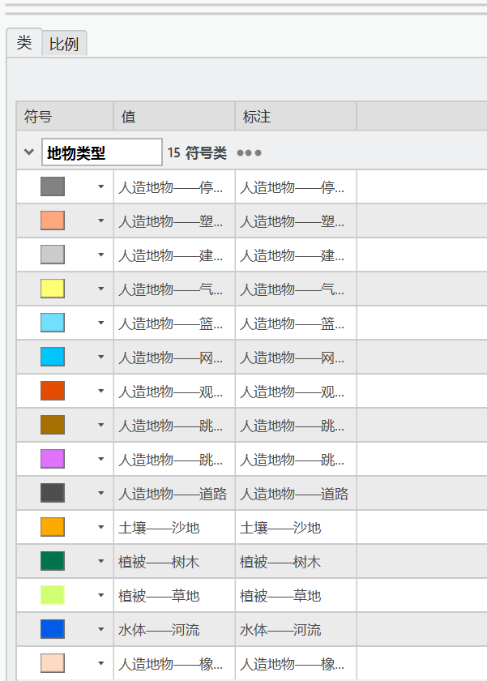
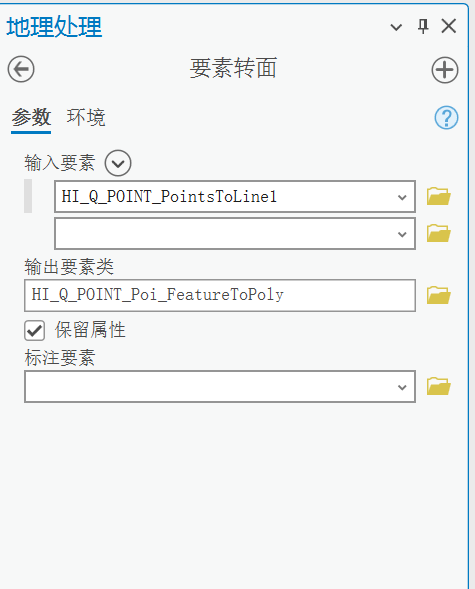
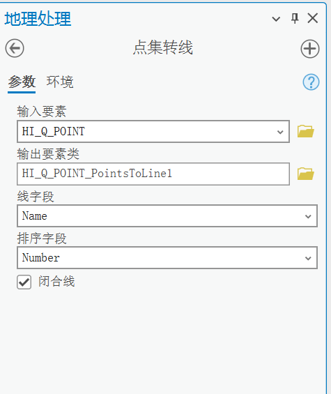
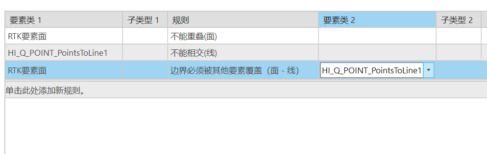
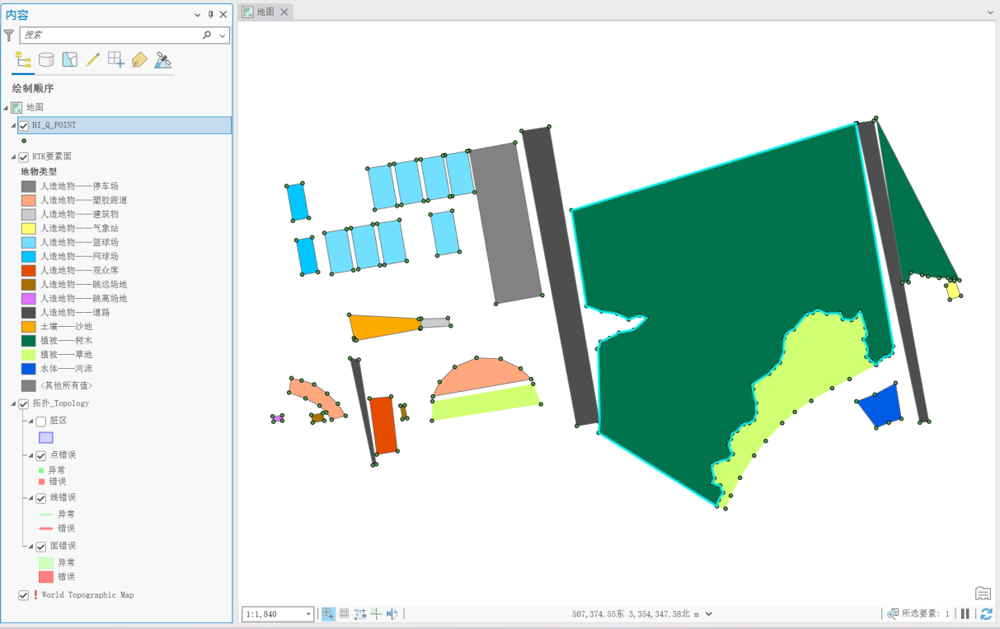
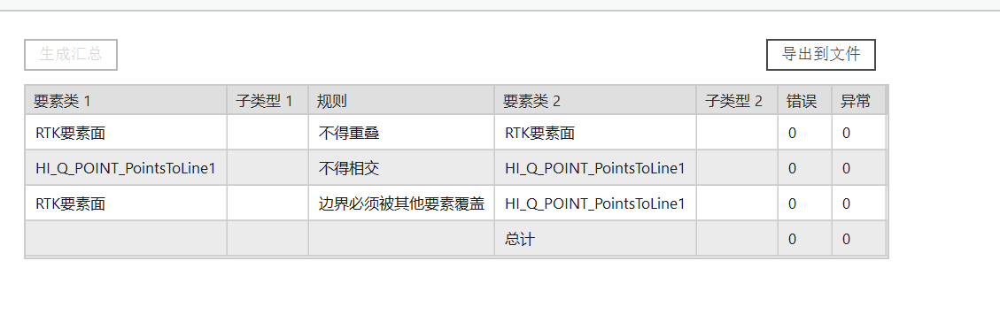
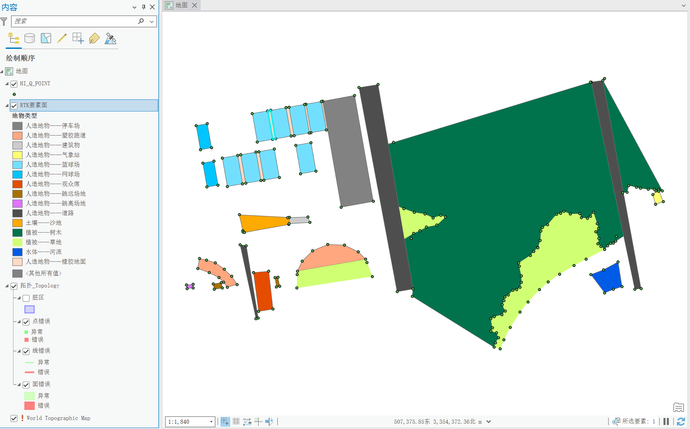

# 实习四：RTK外业测量

## 实习目的

1. 了解北斗RTK高精度定位系统的原理及工作流程

1. 掌握北斗RTK实地的数据采集实践方法

1. 根据采集到的数据，掌握校内地块矢量二维模型构建的方法

1. 熟悉并使用ArcGIS Pro编辑外业获取的数据学会如何在地面合理布设像控点

1. 了解ArcGIS Pro中拓扑图层的构建、验证和拓扑错误察看，熟悉拓扑工具条，并根据拓扑错误修改图形

## 实习内容

1. 选取区域内地块，利用北斗RTK对其进行数据采集的实践

1. 编辑外业数据，根据外业数据创建地块矢量文件，设置属性

1. 建立拓扑层，对二维图斑进行拓扑检查，并修改拓扑错误

## 实习步骤

见《实习手册》

## 实习结果

提交经过拓扑检查后的面要素矢量图层。

请将实习结果的截图附在这里，并加上必要的文字说明

请保存好实习结果的相关文件

**本组在研究区（东操—东篮球场及周边）利用北斗RTK采集各地块轮廓点****。**

**测量中选取的地物包涵多种地物类型，包括植被，水体，土地，人造地物，并且每种类型地物都有不同小类，基本涵盖研究区域内的大部分可满足测量条件的地物****。地物选取中通过增加小型地物的数量，选取大面积的植被要素等方式，使实际测量范围从东到西基本覆盖整个研究区域，避免单一位置的测量。**

**根据地物的聚集情况、面积、数量、边界曲折程度将地物划分为三个采集组别，分工采集，提高采集效率，同时让组内各个成员均进行RTK测量操作，确保小组成员均掌握RTK外业采集技术****。**

**各组别采集地物数据的时间以及天气条件各不相同，采集时间贯穿白天、傍晚和夜晚，采集时的天气涵盖晴天、阴天和小雨，在采集过程中了解了时间和天气对RTK所使用的定位卫星信号沟通的影响。**

**在数据质量方面，****各采集点位的数据均得到RTK固定解****；****曲线边界采集时定位点数量较多，能呈现较为完整曲线****；****测量点均选取直角顶点或分界明显处，精确表示地物位置****。**

**在ArcGIS Pro中经“点集转线—要素转面”生成面要素图层，并按地物类型进行符号化，共构建面要素35个。地物按“一级—二级”分类：人造地物28个（篮球场、橡胶地面、道路、塑胶跑道、网球场、停车场、观众席、跳远/跳高场地、气象站、建筑物等）、植被5个（树木、草地）、水体1个（河流）、土壤1个（沙地），基本涵盖研究区内可测量的主要地物类型。**

**测量点均选取地块直角顶点或分界明显处以精确表示地物位置，曲线边界处加密采点以完整还原轮廓；建立拓扑图层，采用“面不能重叠、面之间不能有缝隙”规则进行拓扑检查，确保相邻地块边界拓扑一致。**

**对检出错误逐一修正，得到最终的面要素矢量图层。**

**经拓扑检查修正后的面要素矢量成果（Shapefile，含“地物类”属性字段）已随报告提交归档。**

## 实习感想

**经验分享：采点时尽量选取直角顶点或分界明显处，曲线边界多采点以完整还原地物轮廓；确认每个点位取得RTK固定解后再记录；组内成员轮流操作，确保均掌握RTK外业采集技术。**

**遇到的困难：不同时间与天气（晴、阴、小雨，白天/傍晚/夜晚）下卫星信号质量不同，会影响定位精度与固定解获取；内业构面后相邻地块之间易出现重叠或缝隙，需借助拓扑检查逐一修正。**

**实验四完整实验数据可见百度网盘**

**https://pan.baidu.com/s/5QKfPnanNhjd7XALowEb9Aw**
