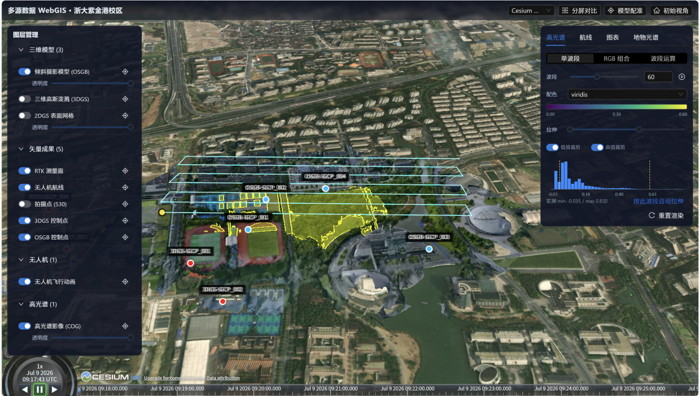

# 实习五：WebGIS开发

本目录是整个项目的 WebGIS 主入口，聚焦 3DGS、OSGB 和高光谱数据在 Cesium 场景中的加载、配准与联动展示。

## 主要文件

- `实习五.md`：完整实验报告
- `WebGIS依赖文件相对路径清单.md`：WebGIS 依赖文件与相对路径说明
- `GIS_drone/`：外业、配准和模型转换相关数据
- `zju_big-3dtiles/`：3DGS 转换结果
- `bip_cogtiff/final-cog.tif`：高光谱 COG 输出

## 说明

这个目录适合作为 WebGIS 项目的总入口，先看 README 和截图，再按需打开报告与各数据子目录。
